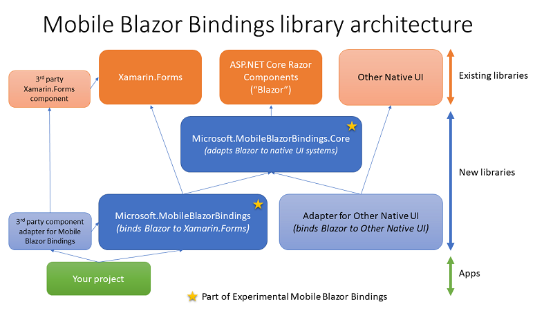

# Architecture of Mobile Blazor Bindings

[!INCLUDE [experiment-warning](../includes/experiment-warning.md)]

Experimental Mobile Blazor Bindings consists of two main libraries:

1. `Microsoft.MobileBlazorBindings.Core`: A library that is used to abstract arbitrary native UI libraries to work with the Blazor UI model. This library contains implementations of an adapter system that maps between native UI elements and Blazor components.
1. `Microsoft.MobileBlazorBindings`: A library that references the Core library and adds specific bindings for Xamarin.Forms elements to enable building native apps for the Android and iOS mobile platforms.

The following diagram shows the relationship between these packages and how they relate to other libraries and apps.

