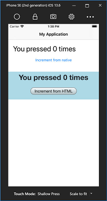

# Experimental Mobile Blazor Bindings

Experimental Mobile Blazor Bindings enable developers to build native and hybrid mobile apps using C# and .NET for Android, iOS, Windows, macOS, and Tizen using familiar web programming patterns. Experimental Mobile Blazor Bindings uses Razor syntax to define UI components and behaviors of an application. The underlying UI components are based on Xamarin.Forms native UI components and in hybrid apps they are mixed with HTML elements.

Blazor runs on [.NET Standard 2.0](https://docs.microsoft.com/dotnet/standard/net-standard) so you can share your .NET code with most other .NET apps.

With Mobile Blazor Bindings it is easy to build a native UI with labels, buttons, and other native UI components:

```xml
<StackLayout>
    <Label FontSize="30"
           Text="@("You pressed " + count + " times")" />
    <Button Text="+1"
            OnClick="@HandleClick" />
</StackLayout>

@code {
    int count;

    void HandleClick()
    {
        count++;
    }
}
```

And here it is running in the Android Emulator:

[  ](./media/index/hello-world-expanded.png#lightbox)

And you can build hybrid apps that mix native UI and HTML UI in the same screen, all sharing the same app logic and state:

* `/Main.razor`: (native UI)

    ```xml
    @inject CounterState CounterState

    <ContentView>
        <StackLayout>

            <StackLayout Margin="new Thickness(20)">
                <Label Text="@($"You pressed {CounterState.CurrentCount} times")" FontSize="30" />
                <Button Text="Increment from native" OnClick="@CounterState.IncrementCount" Padding="10" />
            </StackLayout>

            <BlazorWebView ContentRoot="WebUI/wwwroot" VerticalOptions="LayoutOptions.FillAndExpand">
                <FirstBlazorHybridApp.WebUI.App />
            </BlazorWebView>

        </StackLayout>
    </ContentView>

    @code {
        // initialization code
    }
    ```

* `/WebUI/App.razor`: (HTML UI)

    ```xml
    @inject CounterState CounterState

    <div style="text-align: center; background-color: lightblue;">
        <div>
            <span style="font-size: 30px; font-weight: bold;">
                You pressed @CounterState.CurrentCount times
            </span>
        </div>
        <div>
            <button style="margin: 20px;" @onclick="ClickMe">Increment from HTML</button>
        </div>
    </div>

    @code
    {
        private void ClickMe()
        {
            CounterState.IncrementCount();
        }

        // initialization code
    }
    ```

And here it is running in the iOS Simulator, with native UI on top, and HTML UI on the bottom, sharing app logic and state:

[  ](./media/index/ios-hybrid-expanded.png#lightbox)

To build your first apps, check out these topics:

* [Get Started](get-started.md) to set up your development environment.
* [Build your first app](walkthroughs/build-first-app.md) using native UI components.
* [Build your first hybrid app](walkthroughs/build-first-hybrid-app.md) using a mix of native UI components and HTML UI.

And when you're ready for more, check out the walkthroughs:

* [Todo App](walkthroughs/todo-app.md)
* [Weather App](walkthroughs/weather-app.md)

Then some of the advanced topics:

* [Dependency injection](advanced/dependency-injection.md) - register and share services between parts of the application
* [Writing custom components](advanced/custom-components.md) - build reusable components in your apps
* [Xamarin.Essentials](advanced/xamarin-essentials.md) - provides developers with cross-platform APIs for their mobile applications

And finally, if you'd like to contribute, check out these topics:

* [Roadmap](contribute/roadmap.md)
* [Feedback](contribute/feedback.md)
