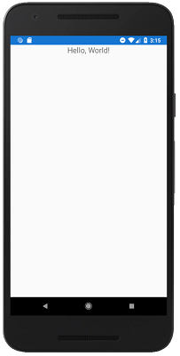

# Experimental Mobile Blazor Bindings

Experimental Mobile Blazor Bindings enable developers to build native mobile apps using C# and .NET for iOS and Android using familiar web programming patterns. Experimental Mobile Blazor Bindings uses Razor syntax to define UI components and behaviors of an application. The underlying UI components are based on Xamarin.Forms native UI components. 

Blazor runs on [.NET Standard 2.0](https://docs.microsoft.com/dotnet/standard/net-standard) so you can share your .NET code with most other .NET apps.

This is a sample `Hello, World!` component:

```xml
<StackLayout>
    <Label FontSize="30"
           Text="@("You pressed " + count + " times")" />
    <Button Text="+1"
            OnClick="@HandleClick" />
</StackLayout>

@code {
    int count;

    void HandleClick()
    {
        count++;
    }
}
```

And here it is running in the Android Emulator:

[  ](media/index/hello-world-expanded.png#lightbox)

To build your first app, check out the [Get Started topic](get-started.md).

And when you're ready for more, check out the walkthroughs:

* [Todo App](walkthroughs/todo-app.md)
* [Weather App](walkthroughs/weather-app.md)

Then some of the advanced topics:

* [Dependency injection](advanced/dependency-injection.md)
* [Writing custom components](advanced/custom-components.md)

And finally, if you'd like to contribute, check out these topics:

* [Roadmap](contribute/roadmap.md)
* [Feedback](contribute/feedback.md)
