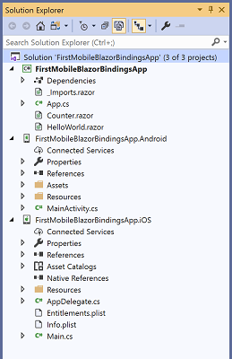
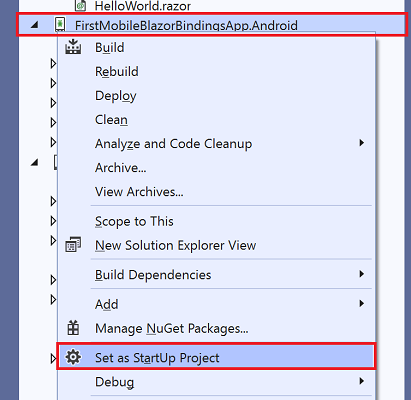
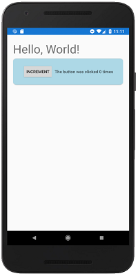

[!INCLUDE [experiment-warning](../includes/experiment-warning.md)]

# Build your first app

The easiest way to get started with Experimental Mobile Blazor Bindings is to create the initial project from the command line.

1. Open a command prompt or shell window
1. Install the Experimental Mobile Blazor Bindings project templates by running this command:

    ```shell
    dotnet new -i Microsoft.MobileBlazorBindings.Templates::0.2.39-preview
    ```

1. Create projects using the project templates by running this command:

    ```shell
    dotnet new mobileblazorbindings -o FirstMobileBlazorBindingsApp
    ```

    This will create a folder named `FirstMobileBlazorBindingsApp` with the solution file (SLN) and three projects in sub-directories:

   1. `FirstMobileBlazorBindingsApp/FirstMobileBlazorBindingsApp.csproj` - this is the shared project that will contain the UI and logic of your mobile application.
   1. `FirstMobileBlazorBindingsApp.Android/FirstMobileBlazorBindingsApp.Android.csproj` - this is the "backend" project for targeting Android devices. On Windows or Mac you can run this project to launch the app in the Android Emulator.
   1. `FirstMobileBlazorBindingsApp.iOS/FirstMobileBlazorBindingsApp.iOS.csproj` - this is the "backend" project for targeting iOS devices. On Mac you can run this project to launch the app in the iOS Emulator.

1. You are now ready to open the solution in Visual Studio. To open the solution you can double-click the SLN file on your disk, or you can first open Visual Studio 2019, select `File` / `Open` / `Project/Solution`, and then navigate to the new folder you created and select `FirstMobileBlazorBindingsApp.sln`. The solution in Visual Studio should look like this:

    [  ](media/build-first-app/solution-explorer-with-all-projects-expanded.png#lightbox)

1. To run the project, you'll need to set one of the "backend" projects as your startup project. In Solution Explorer, right-click on the Android or iOS project and select `Set as StartUp Project`.

    [  ](media/build-first-app/set-startup-project-expanded.png#lightbox)

1. Press <kbd>F5</kbd> to launch the project in the emulator with the debugger attached (or press <kbd>Ctrl</kbd>+<kbd>F5</kbd> to run without the debugger)

1. Your first application will launch in the emulator and look like this:

    [  ](media/build-first-app/android-helloworld-expanded.png#lightbox)

1. Congratulations, you've created and run your first Experimental Mobile Blazor Bindings app!

To learn more about how this works, go to the [Hello World Walkthrough](hello-world.md).
