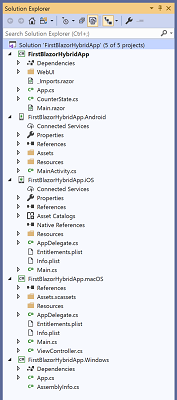
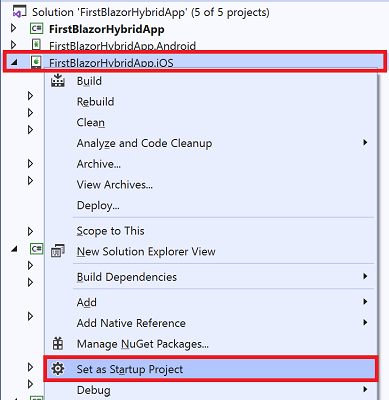
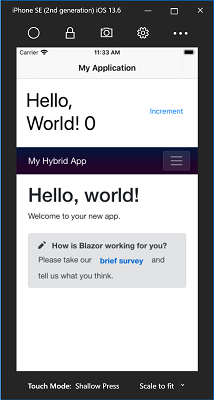

# Build your first hybrid app

[!INCLUDE [experiment-warning](../includes/experiment-warning.md)]

The easiest way to get started with Experimental Mobile Blazor Bindings to build hybrid apps is to create the initial project from the command line. This template supports creating apps for Android, iOS, WPF (Windows), and macOS.

> [!NOTE]
> If you have not yet done so, check the [pre-requisites and template installation instructions](../get-started.md).

1. Open a command prompt or shell window

1. Create your project by running this command:

    ```shell
    dotnet new blazorhybrid -o FirstBlazorHybridApp
    ```

    This will create a folder named `FirstBlazorHybridApp` with the solution file (SLN) and five projects in sub-directories:

   1. `FirstBlazorHybridApp/FirstBlazorHybridApp.csproj` - this is the shared project that will contain the hybrid UI and logic of your application. That is, it will contain both native UI and web UI all using Razor syntax.
   1. `FirstBlazorHybridApp.Android/FirstBlazorHybridApp.Android.csproj` - this is the "backend" project for targeting Android devices. On Windows or Mac you can run this project to launch the app in the Android Emulator.
   1. `FirstBlazorHybridApp.iOS/FirstBlazorHybridApp.iOS.csproj` - this is the "backend" project for targeting iOS devices. On Mac you can run this project to launch the app in the iOS Simulator. On Windows you can run it as well if you have a [Mac that is paired](https://docs.microsoft.com/xamarin/ios/get-started/installation/windows/connecting-to-mac/).
   1. `FirstBlazorHybridApp.Windows/FirstBlazorHybridApp.Windows.csproj` - this is the "backend" project for targeting Windows devices using Windows Presentation Foundation (WPF). On Windows you can run this project to launch the app.
   1. `FirstBlazorHybridApp.macOS/FirstBlazorHybridApp.macOS.csproj` - this is the "backend" project for targeting macOS devices. On Mac you can run this project to launch the app.

1. You are now ready to open the solution in Visual Studio. To open the solution you can double-click the SLN file on your disk, or you can first open Visual Studio 2019, select `File` / `Open` / `Project/Solution`, and then navigate to the new folder you created and select `FirstBlazorHybridApp.sln`. The solution in Visual Studio should look like this:

    [  ](./media/build-first-hybrid-app/solution-explorer-with-all-hybrid-projects-expanded.png#lightbox)

1. To run the project, you'll need to set one of the "backend" projects as your startup project. In Solution Explorer, right-click on the Android, iOS, Windows, or macOS project and select `Set as StartUp Project`.

    [  ](./media/build-first-hybrid-app/set-startup-hybrid-project-expanded.png#lightbox)

1. Press <kbd>F5</kbd> to launch the project in the emulator or on a device (depending on the chosen project) with the debugger attached (or press <kbd>Ctrl</kbd>+<kbd>F5</kbd> to run without the debugger)

   * Tip: If you want to run the iOS project on the iOS Simulator, ensure that you select the `iPhoneSimulator` target from the Visual Studio toolbar instead of `iPhone`.

1. Your first application will launch in an emulator or on a device and look like this:

    [  ](./media/build-first-hybrid-app/ios-hybrid-helloworld-expanded.png#lightbox)

1. Congratulations, you've created and run your first Experimental Mobile Blazor Bindings hybrid app!

> [!TIP]
> If you're experiencing a problem, refer to the [troubleshooting guide](../advanced/troubleshooting.md).

> [!TIP]
> See the [advanced template options](../advanced/template-options.md) topic for more options when creating a new project.

## Next steps

* To learn more about how this works, go to the [Hybrid Hello World Walkthrough](hybrid-hello-world.md).
* To learn how to share the web UI with a Blazor Web App, go to the [Shared Web UI Walkthrough](shared-web-ui.md).
