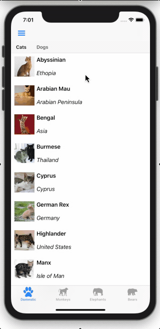
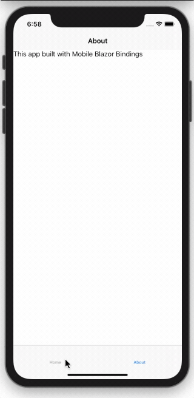
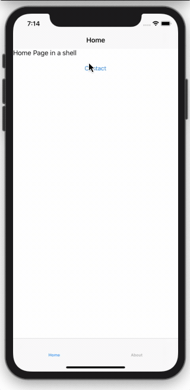
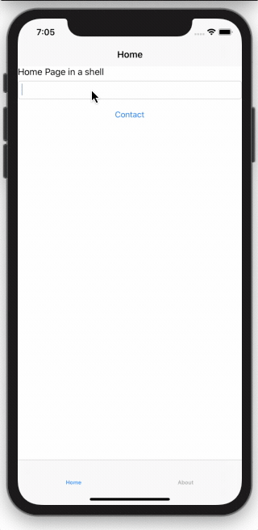

# Shell Navigation Manager

[!INCLUDE [experiment-warning](../includes/experiment-warning.md)]

There are several different approaches to navigation in Mobile Blazor Bindings. They are based on Xamarin.Forms navigation patterns such as Master/Detail, TabbedPage, Navigation Page, and Shell.

Shell Navigation Manager is designed to feel familiar to Blazor developers. The routes are added using the `@page` directive with the same format, including parameters, and the navigation manager is accessed via dependency injection.

Internally it is implemented using Xamarin.Forms Shell URI Navigation. Shell has support for top tabs, bottom tabs, hamburger/flyout, stack, modal and URI-based navigation. These can all be mixed together or used in isolation, depending on what your app needs.



For more details on Shell, check out the [Xamarin Forms documentation](/xamarin/xamarin-forms/app-fundamentals/shell/). Details of routing in Blazor are in the [ASP.NET Core documentation](/aspnet/core/blazor/fundamentals/routing)

For a sample of ShellNavigationManager see the [Xaminals sample in the Mobile Blazor Bindings repo](https://github.com/xamarin/MobileBlazorBindings/tree/master/samples/MobileBlazorBindingsXaminals).

## Setup

To use the `ShellNavigationManager` you'll need to have a `Shell` as the `MainPage` in your app.

To start off here is a simple `Shell` that has two tabs: one for a HomePage, and one for an AboutPage. This should be in a file called `AppShell.razor`.

```xml
<Shell FlyoutBehavior="FlyoutBehavior.Disabled">
    <TabBar>
        <Tab>
            <ShellContent>
                <HomePage />
            </ShellContent>

            <ShellContent>
                <AboutPage />
            </ShellContent>
        </Tab>
    </TabBar>
</Shell>
```



> [!IMPORTANT]
> The `HomePage` and `AboutPage` must have `ContentPage` as their root element to be used in `Shell`.

Inside `App.cs`, the `AppShell` needs to be set as the `MainPage` of the app. This is done by calling `AddComponent`. Setting the `Shell` as the `MainPage` is done in the background so we also have to set a blank `ContentPage` as a placeholder while it is loading.

To enable `ShellNavigationManager` and make it available for our pages we add it as a singleton service.

This should give you an `App` constructor that looks like this:

```c#
public App()
{
    AppHost = MobileBlazorBindingsHost.CreateDefaultBuilder()
        .ConfigureServices((hostContext, services) =>
        {
            // Register app-specific services
            //services.AddSingleton<AppState>();
            services.AddSingleton<ShellNavigationManager>();
        })
        .Build();

    MainPage = new ContentPage();
    AppHost.AddComponent<AppShell>(parent: this);
}
```

## Registering Routes

Route registration occurs in each Razor component that you want to be able to navigate to. Routes are defined using the `@page` directive followed by a string URI. This URI must start with a slash.

For example, here's a contact page with the route `/contact`.

```xml
@page "/contact"
<ContentPage>
    <StackLayout>
        <Label Text="Phone Number:"></Label>
        <Label Text="123456"></Label>
    </StackLayout>
</ContentPage>
```

Multiple routes can be placed on a page if required.

> [!NOTE]
> As of the 0.6 Preview The target of a Shell navigation must derive from the `Page` type. Prior to the 0.6 Preview release the target had to derive from `ContentView`.

## Navigating to a page

Navigation between pages is achieved using the Shell Navigation Manager, which you can access in your components using the `@inject` directive. Once you have an instance you call `NavigateToAsync()` with the URI of the page you want to open.

The following example shows a page with a `Button` that when pressed will navigate to the `ContactPage`.

```xml
@inject ShellNavigationManager NavigationManager
<ContentPage>
    <StackLayout>
        <Button Text="Contact"
                OnClick="OpenContactPage">
        </Button>
    </StackLayout>
</ContentPage>

@code
{
    async Task OpenContactPage()
    {
        await NavigationManager.NavigateToAsync("/contact");
    }
}
```



## Navigation parameters

When navigating to a page you will often want to pass data to the destination page. In Blazor you can pass data as parameters in the URI.

To set up a page to accept a navigation parameter you will need to add a property to the page and mark it with the `[Parameter]` attribute.

e.g.

```c#
[Parameter] public string Name { get; set; }
```

Then you need to add a route for the page with the parameter name, surrounded with `{}` at the end of the `/` separated URI.

For example:

```xml
@page "/contact/{Name}"
```

To navigate to this page with a parameter, substitute the name you want to pass into the URI and use the same `NavigateToAsync` function. For example:

```c#
await NavigationManager.NavigateToAsync("contact/Dunston");
```

When the `ContactPage` is navigated to, you can read the value of the `Name` by accessing the `Name` property in the page.



Navigation parameters can be any of several .NET types that can be easily converted into strings, such as `int`, `string`, `Guid`, and `DateTime`. Full details of supported types are available in the [Blazor Routing documentation](/aspnet/core/blazor/fundamentals/routing#route-constraints)
