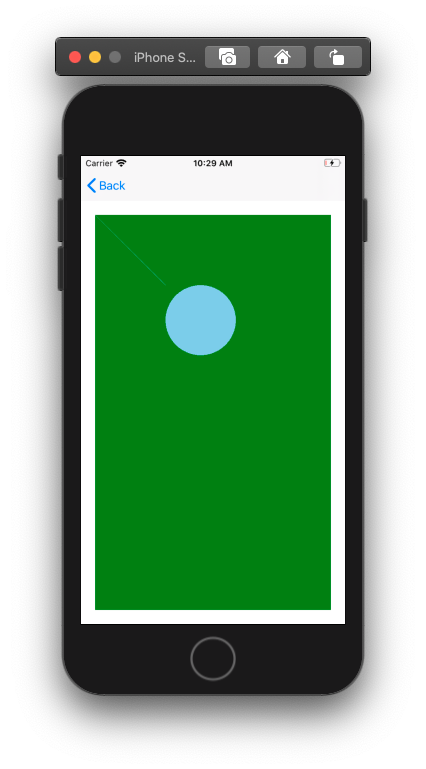

[!INCLUDE [experiment-warning](../includes/experiment-warning.md)]

# Skia Sharp

## Intro
Skia is a 2D graphics library maintained by Google, it can be used inside .Net application using [SkiaSharp](https://github.com/mono/SkiaSharp). SkiaSharp is available in Mobile Blazor Bindings apps using the Microsoft.MobileBlazorBindings.SkiaSharp Nuget, which is built on top of SkiaSharp.Views.Forms.

This guide covers the basics of how to add a Skia Sharp Canvas to a Razor Component for use in a Mobile Blazor Bindings app, all other API are exactly the same and are covered in [SkiaSharp Graphics in Xamarin.Forms](https://docs.microsoft.com/xamarin/xamarin-forms/user-interface/graphics/skiasharp/).

## Setup
To get started install the `Microsoft.MobileBlazorBinding.SkiaSharp` Nuget in your .NET Standard Mobile Blazor Binds app project and in the iOS and Android projects.

## Usage

In a Razor Components, add an `SKCanvasView` from the `Microsoft.MobileBlazorBinding.SkiaSharp` namespace with a method `PaintSurface` on the `OnPaintSurface` event.

e.g. 
```
@using Microsoft.MobileBlazorBindings.SkiaSharp

<ContentView>
    <StackLayout Padding="20">
        <SKCanvasView
            OnPaintSurface="PaintSurface"/>
    </StackLayout>
</ContentView>
```

In the `@code` block add a method `PaintSurface` that takes an `SKPaintSurfaceEventArgs e`. This method is the only place where you'll interact with the canvas which is accessed through the `Surface.Canvas` on the SKPaintSurfaceEventArgs.

Once you have a reference to the `canvas` you can add paths, shapes, images and more. To get started you can clear the canvas and set a background color and add a line and a circle.

```
private void PaintSurface2(SK.SKPaintSurfaceEventArgs e)
{
    var canvas = e.Surface.Canvas;
    canvas.Clear(SKColors.Green);
    var paint = new SKPaint { Color = SKColors.SkyBlue, };
    canvas.DrawLine(0, 0, 200, 200, paint);
}
```



That's all you need to get SkiSharp running in a Mobile Blazor Bindings app, from here on, everything is the same as in the [Xamarin Forms SkiaSharp docs](https://docs.microsoft.com/xamarin/xamarin-forms/user-interface/graphics/skiasharp/). For a sample of SkiaSharp in Mobile Bindings check out the `SkiaCanvasDemo.razor` and `SkiaCanvasDemo.razor.cs` in the [Controls Gallery Sample](https://github.com/xamarin/MobileBlazorBindings/tree/master/samples/ControlGallery/ControlGallery/Views).

