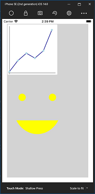

# Skia Sharp

[!INCLUDE [experiment-warning](../includes/experiment-warning.md)]

Skia is a 2D graphics library maintained by Google that can be used in .NET applications using the [SkiaSharp](https://github.com/mono/SkiaSharp) library. SkiaSharp is available in Mobile Blazor Bindings apps using the `Microsoft.MobileBlazorBindings.SkiaSharp` NuGet package, which is built on top of `SkiaSharp.Views.Forms`.

This guide covers the basics of how to add a Skia Sharp Canvas to a Razor Component for use in a Mobile Blazor Bindings app, all other API are exactly the same and are covered in [SkiaSharp Graphics in Xamarin.Forms](https://docs.microsoft.com/xamarin/xamarin-forms/user-interface/graphics/skiasharp/).

## Setup

To get started install the following NuGet packages:

1. Into the .NET Standard project with your Razor files install the `Microsoft.MobileBlazorBindings.SkiaSharp` NuGet package.
1. Install the platform-specific NuGet packages in each platform project:
    1. iOS and Android projects: install the `SkiaSharp.Views.Forms` NuGet package.
    1. Windows projects: install the `SkiaSharp.Views.Forms.WPF` NuGet package.

In the `_Imports.razor` file at the root of the project add the following lines to import the SkiaSharp components and APIs into all Razor files:

```c#
@using Microsoft.MobileBlazorBindings.SkiaSharp
@using SkiaSharp
@using SkiaSharp.Views.Forms
```

## Usage

In your Razor component add an `SKCanvasView` component and set the `OnPaintSurface` event to a method named `PaintSurface`:

```xml
<ContentView>
    ...
        <SKCanvasView OnPaintSurface="PaintSurface"/>
    ...
</ContentView>
```

In the `@code` block add a method `PaintSurface` that takes a parameter of type `SKPaintSurfaceEventArgs`. This method is the only place where you'll interact with the canvas, which is accessed through the `Surface.Canvas` property of the provided `SKPaintSurfaceEventArgs`.

The Razor file should now look like this:

```xml
<ContentView>
    <StackLayout Padding="20">
        <SKCanvasView OnPaintSurface="PaintSurface"/>
    </StackLayout>
</ContentView>

@code
{
    void PaintSurface(SKPaintSurfaceEventArgs e)
    {
        // TODO: SkiaSharp painting code goes here
    }
}
```

Once you have a reference to the canvas you can add paths, shapes, images, and more. To get started you can clear the canvas, set a background color, and add a line:

```c#
void PaintSurface(SKPaintSurfaceEventArgs e)
{
    var canvas = e.Surface.Canvas;
    canvas.Clear(SKColors.Green);
    var paint = new SKPaint { Color = SKColors.SkyBlue, };
    canvas.DrawLine(0, 0, 200, 200, paint);
}
```

Or you could draw a line graph along with a face with this code:

```csharp
    void PaintSurface(SKPaintSurfaceEventArgs e)
    {
        var canvas = e.Surface.Canvas;
        canvas.Clear(SKColors.LightGray);

        // Draw outline
        var outlinePaint = new SKPaint { Color = SKColors.White, StrokeWidth = 2, };
        canvas.DrawRoundRect(5, 5, 410, 410, 5, 5, outlinePaint);

        // Draw axes
        var axisPaint = new SKPaint { Color = SKColors.DarkGray, StrokeWidth = 5, };
        canvas.DrawLine(20, 20, 20, 410, axisPaint);
        canvas.DrawLine(10, 400, 400, 400, axisPaint);

        // Draw graph
        var yValues = new[] { 10, 100, 160, 120, 180, 350 };
        var graphLinePaint = new SKPaint { Color = SKColors.DarkBlue, StrokeWidth = 4, };
        var graphPointPaint = new SKPaint { Color = SKColors.LightBlue, StrokeWidth = 4, };

        for (int i = 0; i < yValues.Length; i++)
        {
            var fromPoint = new SKPoint(i * 70 + 20, 400 - yValues[i]);
            if (i != yValues.Length - 1)
            {
                var toPoint = new SKPoint((i + 1) * 70 + 20, 400 - yValues[i + 1]);
                canvas.DrawLine(fromPoint, toPoint, graphLinePaint);
            }
            canvas.DrawCircle(fromPoint, radius: 8, graphPointPaint);
        }

        // Draw face
        var facePaint = new SKPaint { Color = SKColors.Yellow, StrokeWidth = 3, };
        canvas.DrawArc(new SKRect(50, 450, 450, 900), startAngle: 30, sweepAngle: 120, useCenter: false, facePaint);
        canvas.DrawCircle(125, 600, 30, facePaint);
        canvas.DrawCircle(375, 600, 30, facePaint);
    }
```

[  ](./media/skiasharp/skiasharp-expanded.png#lightbox)

That's all you need to get SkiaSharp running in a Mobile Blazor Bindings app. From here on, everything is the same as in the [Xamarin.Forms SkiaSharp docs](https://docs.microsoft.com/xamarin/xamarin-forms/user-interface/graphics/skiasharp/). For a sample of SkiaSharp in Mobile Bindings check out the `SkiaCanvasDemo.razor` and `SkiaCanvasDemo.razor.cs` in the [Controls Gallery Sample](https://github.com/xamarin/MobileBlazorBindings/tree/master/samples/ControlGallery/ControlGallery/Views).

## Troubleshooting

If you get an error about missing libraries such as `Error: framework not found libSkiaSharp`, check that you installed the platform-specific NuGet package into each platform-specific project (such as iOS, Android, and Windows) as noted in the [setup](#setup) section.
