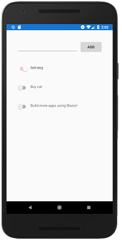

[!INCLUDE [experiment-warning](../includes/experiment-warning.md)]

# Todo App

The completed Todo app sample is available [here](https://github.com/xamarin/MobileBlazorBindings/tree/master/samples/MobileBlazorBindingsTodoSample). The sample uses dependency injection, platform-specific services, a SQLite database for storage, modal dialogs, custom images, and many more features. This sample shows how to render a dynamically growing list of `Todo` items.

To build a simple Todo app, start with the project you've already created in the [Build your first app](build-first-app.md) section. All the changes will be in the `FirstMobileBlazorBindingsApp` project.

1. Delete the `HelloWorld.razor` and `Counter.razor` files.

1. Add a new class file to the project named `TodoItem.cs`. In this file, define a new class to represent a Todo Item. Change the code in this class to the following code:

    ```csharp
    namespace FirstMobileBlazorBindingsApp
    {
        public class TodoItem
        {
            public string Text { get; set; }
            public bool IsDone { get; set; }
        }
    }
    ```

1. Add a new Razor component to the project by right-clicking on the project, selecting `Add` / `New Item`, select `Razor component`, and naming it `TodoApp.razor`. Replace the code in the file with the following code:

    ```xml
    <ContentPage>
        <StackLayout Margin="new Thickness(20)">

            @* Entry area *@
            <StackLayout Margin="new Thickness(20)" Orientation="StackOrientation.Horizontal">
                <Entry @bind-Text="newItemText" HorizontalOptions="LayoutOptions.FillAndExpand" />
                <Button Text="Add" OnClick="OnAddItem" />
            </StackLayout>

            @* TodoItem area *@

            @* TODO: This! *@

        </StackLayout>
    </ContentPage>

    @code
    {
        string newItemText;

        List<TodoItem> items = new List<TodoItem>();

        void OnAddItem()
        {
            var newTodoItem = new TodoItem
            {
                Text = newItemText,
            };

            items.Add(newTodoItem);

            // Clear out the text in the Entry textbox
            newItemText = null;
        }
    }
    ```

1. Change the code in `App.cs` to reference the new `TodoApp` component instead of `HelloWorld`:

    ```csharp
    host.AddComponent<TodoApp>(parent: this);
    ```

1. If you run the app, you'll see an Entry textbox and an Add button. If you type in text and tap the Add button the text will simply disappear. The `Entry` component has a two-way binding to the `newItemText` field by using the Blazor syntax `@bind-Text="newItemText"`. When the `Text` property of the `Entry` changes, the `newItemText` field will be updated, and when the `newItemText` field is updated the `Entry` component's `Text` property will be updated for the next re-render. However, this app is still not useful: you can add items to a todo list but you can't see the todo list itself!

1. To show individual todo items, add a Razor Component to the project named `TodoItemDisplay.razor` with the following code:

    ```xml
    <StackLayout Margin="new Thickness(20)" Orientation="StackOrientation.Horizontal">
        <Switch @bind-IsToggled="Item.IsDone" />
        <Label Text="@Item.Text"
            TextDecorations="(Item.IsDone ? TextDecorations.Strikethrough : TextDecorations.None)"
            HorizontalOptions="LayoutOptions.FillAndExpand" />
    </StackLayout>

    @code
    {
        [Parameter] public TodoItem Item { get; set; }
    }
    ```

    This component defines UI to show an individual `TodoItem` object. It accepts a `TodoItem` object via a Blazor component parameter, denoted by the `[Parameter]` attribute. This enables a calling component to pass in a value. This component uses a two-way binding `@bind-IsToggled="Item.IsDone"` to change the value of the `Item.IsDone` property when the `Switch` component's switch is toggled. When this binding takes place, it will cause the `TextDecorations.Strikethrough` style to be applied to the `Label` component when the item is marked as done.

1. To render the todo list, go to the `TodoApp.razor` file and replace the text `@* TODO: This! *@` with the following code:

    ```xml
    <ScrollView>
        <StackLayout>
            @foreach (var item in items)
            {
                <TodoItemDisplay Item="item" />
            }
        </StackLayout>
    </ScrollView>
    ```

    This code uses a C# `foreach` loop to iterate over the list of todo items and render a `TodoItemDisplay` component for each one, passing in the current item to the component's `Item` property: `Item="item"`.

1. You can now run the app and add todo items and see them rendered in the list below. If you toggle the switch on a given item, the text of that item will have the strikethrough decoration applied:

    [  ](media/todo-app/todoapp-completed-expanded.png#lightbox)

Congratulations, you've built a todo app using Experimental Mobile Blazor Bindings that demonstrates how to build custom components with parameters, how to use two-way bindings, and how to loop over items to render a dynamic UI.
